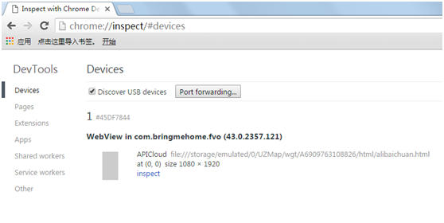
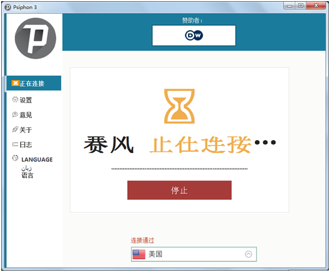
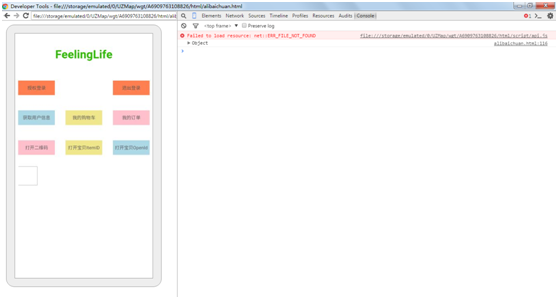
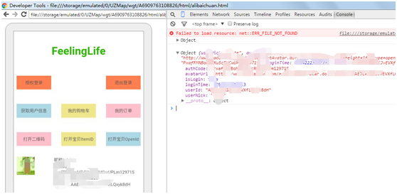

# chromeDebug
APICloud平台上，chromeDebug模块的使用手册


1、打开chrome，输入chrome://inspect/#devices，就能看到制作的网页

当然页面必须包含chromeDebug模块，
```js
var chromedebug = null;
apiready = function() {
	chromedebug = api.require('chromeDebug');
	openchromelog();
};
function openchromelog() {
	chromedebug.openDebug(function(ret, err) {
		if (212 == ret.code) {
			alert(JSON.stringify(ret));
		} else {
			console.log(ret);
		}
	});
}
```



2、点击inspect，首次打开应该是白板如下


你需要翻墙了，用vpn工具翻墙，我喜欢用赛风，因为免费的嘛，



3、连接成功后，你再次点击inspect，需要等待一会，如果不行那就要多试几次，因为免费的软件总归没那么稳定。等出现以下界面，即可





<br/>
<br/>
4、如果还有问题的话，请联系作者(sin@feeling.life)